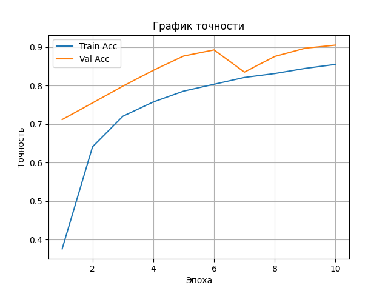
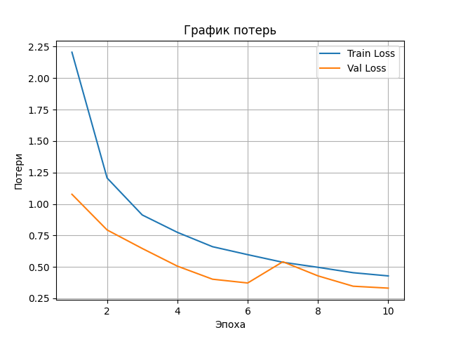
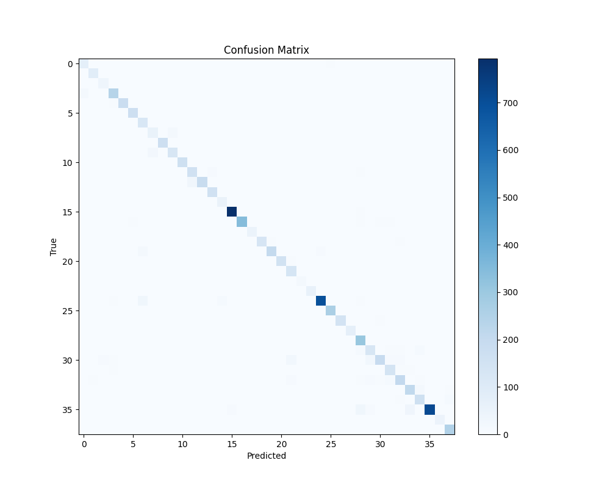

# Классификация болезней растений по изображениям листьев
> В работе использовались цветные картинки (PlantVillage-Dataset/raw/color/) из датасета [PlantVillage](https://github.com/spMohanty/PlantVillage-Dataset.git). Для проверки работы кода рекомендуется установить его и разместить в соответствии с указанной ниже структурой проекта.

---

## Структура проекта

```
project/
│
├── plant_disease_classifier.py       # Главный скрипт запуска
├── plots/                            # Графики потерь, точности и матрица ошибок
├── src/                              # Основной код
│   ├── config.py                     # Конфигурация проекта (пути, устройство, гиперпараметры)
│   ├── dataloader.py                 # Загрузка и аугментация изображений
│   ├── model.py                      # Модель (SimpleCNN)
│   ├── train.py                      # Процесс обучения модели
│   ├── evaluate.py                   # Оценка модели и отчёты
│   ├── infer.py                      # Предсказание класса по изображению
│   └── utils.py                      # Построение графиков
├── PlantVillage-Dataset/             # Датасет с цветными изображениями на сером фоне
├── best_model.pth                    # Сохранённые веса лучшей модели обучения
```

---

## Доступные команды

```bash
# Обучение модели
python plant_disease_classifier.py --mode train

# Оценка модели на тестовой выборке
python plant_disease_classifier.py --mode eval

# Предсказание по изображению
python plant_disease_classifier.py --mode infer --image_path "path_to_image.jpg"
```

---

## Результаты обучения (`--mode train`)

### Пример вывода консоли во время обучения:

| Эпоха | Потери (тренировочный набор) | Потери (проверочный набор) | Точность (тренировочный набор) | Точность (проверочный набор) |
|:-----:|:--------------:|:------------:|:----------------:|:--------------:|
| 1     | 2.2388         | 0.9775       | 38.13%           | 73.54%         |
| 2     | 1.1232         | 0.6868       | 65.83%           | 79.19%         |
| 3     | 0.8448         | 0.5540       | 73.60%           | 82.70%         |
| 4     | 0.7194         | 0.4822       | 77.54%           | 86.48%         |
| 5     | 0.6013         | 0.4468       | 80.56%           | 86.80%         |
| 6     | 0.5163         | 0.4908       | 82.96%           | 85.50%         |
| 7     | 0.4869         | 0.3884       | 83.66%           | 87.48%         |
| 8     | 0.4376         | 0.3734       | 85.47%           | 89.49%         |
| 9     | 0.3976         | 0.3141       | 86.54%           | 90.67%         |
| 10    | 0.3815         | 0.3308       | 87.07%           | 90.13%         |

<sub>Для повышения читабельности примера вывод был переведён на русский язык. Для получения полного вывода предлагается установить проект на компьютер и запустить указанную в подзаголовке команду.</sub>

<table>
  <tr>
    <td>График точности:</td>
    <td>График потерь:</td>
  </tr>
  <tr>
    <td></td>
    <td></td>
  </tr>
</table>

---

## Результаты тестирования (`--mode eval`)

### Пример итоговой метрики модели на тестовой выборке:

| Метрика             | Значение |
|---------------------|----------|
| Общая точность      | 89.77%   |
| Точность по классам | 90.75%   |
| Полнота             | 89.77%   |
| F1-значение         | 89.91%   |

### Фрагмент отчета классификации:

| Класс болезни                      | Точность | Полнота | F1-мера | 
|------------------------------------|----------|---------|---------|
| Яблоко – парша                     | 87%      | 79%     | 83%     |
| Яблоко – черная гниль              | 89%      | 99%     | 93%     |
| Помидор – вирус скручивания листа  | 98%      | 93%     | 96%     |
| Помидор – здоровый                 | 96%      | 99%     | 97%     |

<sub>Для повышения читабельности примера вывод был обрезан и переведён на русский язык. Для получения полного вывода предлагается установить проект на компьютер и запустить указанную в подзаголовке команду.</sub>

<table>
  <tr>
    <td>График матрицы ошибок:</td>
  </tr>
  <tr>
    <td></td>
  </tr>
</table>
